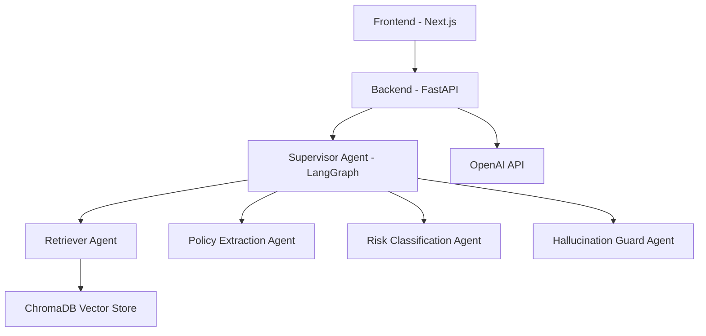

# GitHub Setup Guide

## Step 1: Create GitHub Repository

1. **Go to GitHub** and sign in: https://github.com
2. **Click the "+" icon** in the top right → "New repository"
3. **Repository settings:**
   - Name: `compliance-copilot` (or your preferred name)
   - Description: "AI-powered compliance analysis system for banks using LangChain, LangGraph, and multi-agent architecture"
   - Visibility: **Public** (for portfolio) or **Private** (if you prefer)
   - **DO NOT** initialize with README, .gitignore, or license (we already have these)
4. **Click "Create repository"**

## Step 2: Initialize Git and Push to GitHub

```bash
# Navigate to your project directory
cd /Users/srikarvadlamani/Desktop/agent

# Initialize git (if not already done)
git init

# Add all files
git add .

# Create initial commit
git commit -m "Initial commit: Compliance Copilot - Multi-agent AI system for banking compliance"

# Add GitHub remote (replace YOUR_USERNAME with your GitHub username)
git remote add origin https://github.com/YOUR_USERNAME/compliance-copilot.git

# Rename branch to main (if needed)
git branch -M main

# Push to GitHub
git push -u origin main
```

## Step 3: Update .gitignore (Already Done)

Your `.gitignore` should already exclude:
- `venv/`, `node_modules/`
- `.env` files (important for security!)
- `chroma_db/` (vector database files)
- `__pycache__/`, `.next/`

## Step 4: Add README Badges (Optional but Professional)

Add this to the top of your README.md:

```markdown
# Compliance Copilot for Banks


```

## Step 5: Create GitHub Actions for CI/CD (Optional)

Your project already has `.github/workflows/ci.yml` - this will automatically run tests on push!

## Step 6: Add Repository Topics/Tags

On your GitHub repo page:
1. Click the gear icon ⚙️ next to "About"
2. Add topics: `python`, `fastapi`, `nextjs`, `langchain`, `langgraph`, `kubernetes`, `terraform`, `ai`, `rag`, `multi-agent`, `compliance`, `banking`

## Step 7: Create a GitHub Release (For Portfolio)

1. Go to your repo → "Releases" → "Create a new release"
2. Tag: `v1.0.0`
3. Title: `Compliance Copilot v1.0.0`
4. Description:
   ```
   ## Features
   - Multi-agent AI system with 5 specialized agents
   - RAG pipeline with ChromaDB vector database
   - LangGraph orchestration
   - Kubernetes deployment with Terraform
   - Next.js frontend on Vercel
   - Production-ready architecture
   ```

## Step 8: Update README with Live Demo Links

Add to your README.md:

```markdown
## 🚀 Live Demo

- **Frontend:** [Your Vercel URL]
- **API Docs:** [Your Backend URL]/docs
- **GitHub:** [Your Repo URL]
```

## Security Checklist

✅ **Before pushing:**
- [ ] `.env` files are in `.gitignore`
- [ ] No API keys in code
- [ ] `secrets.yaml` has placeholder values
- [ ] No real credentials committed

## Quick Commands Reference

```bash
# Check what will be committed
git status

# See what's in .gitignore
cat .gitignore

# Add specific files
git add backend/ frontend/ README.md

# Commit changes
git commit -m "Your commit message"

# Push to GitHub
git push origin main

# Create a new branch for features
git checkout -b feature/new-feature
```

## Making Your Repo Stand Out

1. **Add screenshots** to README.md showing the UI
2. **Add architecture diagram** (can use Mermaid in markdown)
3. **Link to deployed demo** (Vercel for frontend)
4. **Add video demo** (optional but impressive)
5. **Write detailed README** with setup instructions
6. **Add LICENSE file** (MIT is common for portfolios)

## Example README Additions

Add this architecture diagram to your README:

````markdown
## Architecture


````

## Next Steps After GitHub Setup

1. **Deploy to Vercel** (frontend) - connect your GitHub repo
2. **Deploy to Cloud Run/GKE** (backend) - use the Kubernetes configs
3. **Add to your LinkedIn** - link to GitHub repo
4. **Add to your portfolio website** - showcase the project
5. **Write a blog post** - explain the architecture (optional but great for SEO)

